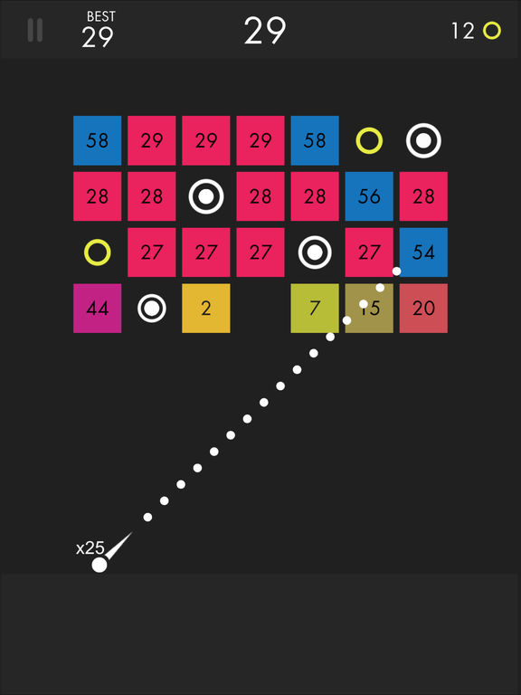
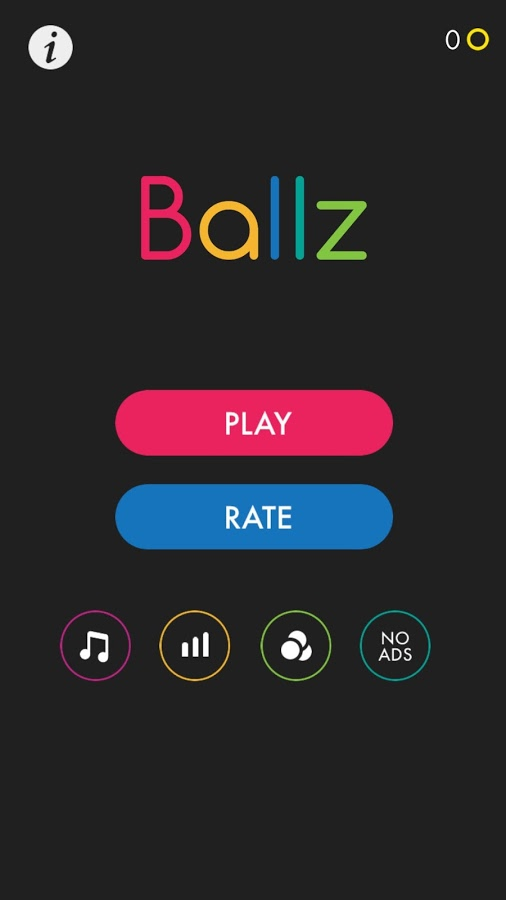

# Blockz
A clone of the mobile game "Ballz"

-------------------------------------

## About Ballz

Ballz is a mobile game created by the game studio Ketchapp, 
where the objective is to collect ballz and use them to 
destroy squares of differing health values.

-------------------------------------

The goal of this project is to recreate the game in its 
entirety, save the ads and cosmetic upgrade system.

This game uses cookies to save your high score or progress.

-------------------------------------

## Known bugs
* None yet

-------------------------------------

## TODO
* Add website icon that shows up in browser tab
* Figure out music that should play in menu and in game
* Use localStorage to track progress/highscore
* Add a script to load a previous session if game never ended
* Add tutorial to main menu if needed later
* Ball counter should count down
* Blocks color changing to be implemented
* Blocks shifting down need animations
* Rework aim line to be more faithful

-------------------------------------
## Contact me
Email me at <jcommons2002@gmail.com>

-------------------------------------
## Images

